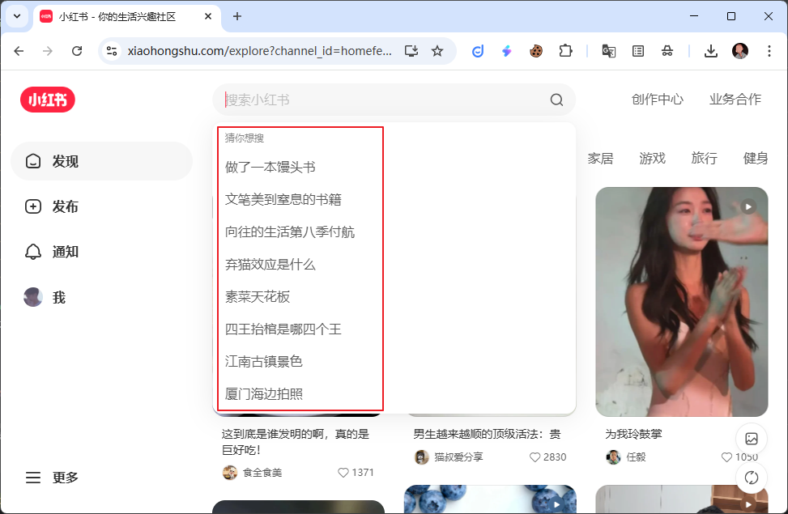
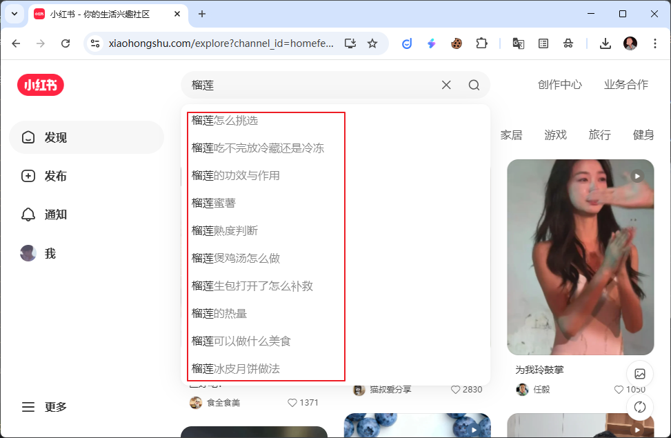

# 小红书采集器 (Rednote Scraper)

小红书采集器是一个强大的网络爬虫，可以从[小红书](https://www.xiaohongshu.com/)网站上提取各种数据。它支持多种数据采集目标，包括用户信息、笔记、评论、搜索结果等，并且能够模拟用户进行点赞、收藏、发布笔记等操作。

[Start Now (On Apify)](https://apify.com/doliz/rednote-scraper)

## 功能

该采集器支持以下功能：

- **用户数据**: 获取当前用户信息、其他用户信息、新增关注、赞和收藏、评论和@提醒。
- **笔记数据**: 获取首页推荐、用户发布的笔记、用户赞过和收藏的笔记、笔记详情、评论等。
- **搜索功能**: 搜索笔记、用户、话题、地点。
- **关键词**: 获取关键词趋势、推荐和热门词。
- **互动操作**: 点赞/取消点赞笔记、收藏/取消收藏笔记、发布/删除评论、点赞/取消点赞评论。
- **内容发布**: 发布图文笔记、创建话题。

## 输入

### `target`
选择要执行的数据采集或操作任务。根据您的选择，下面相应的设置将被使用。

| 值 | 描述 | 示例图      |
|---|---|----------|
| `me` | 当前用户信息1 | /        |
| `self_info` | 当前用户信息2 | /        |
| `keyword_trending` | 关键词趋势(猜你想搜) |     |
| `keyword_recommend` | 关键词推荐 ||
| `mentions` | 评论和@ |
| `likes` | 赞和收藏 |
| `follows` | 新增关注 |
| `homefeed_category` | 首页推荐-分类 |
| `homefeed` | 首页推荐 |
| `hot_words` | 热门词推荐 |
| `search_note` | 搜索笔记 |
| `search_user` | 搜索用户 |
| `user_info` | 用户信息 |
| `user_note` | 用户发布的笔记 |
| `user_like_note` | 用户赞过的笔记 |
| `user_collect_note` | 用户收藏的笔记 |
| `note_info` | 笔记信息 |
| `get_comment` | 获取一级评论 |
| `get_sub_comment` | 获取二级评论 |
| `like_note` | 点赞笔记 |
| `dislike_note` | 取消点赞笔记 |
| `collect_note` | 收藏笔记 |
| `uncollect_note` | 取消收藏笔记 |
| `post_comment` | 发布评论 |
| `delete_comment` | 删除评论 |
| `like_comment` | 点赞评论 |
| `dislike_comment` | 取消点赞评论 |
| `search_topic` | 搜索话题 |
| `create_topic` | 创建话题 |
| `search_location` | 搜索地点 |
| `publish_note` | 发布图文笔记 |

### `cookies`
**必需。** 您的 小红书 cookies。有关如何获取的说明，请参阅“如何获取 Cookies”部分。

---

### 首页推荐 (`homefeed`)

| 字段 | 描述 | 默认值 |
|---|---|---|
| `homefeed_cursor_score` | 分页游标，从前一页的结果中获取，第一页时为空。 | `""` |
| `homefeed_num` | 笔记数量。 | `50` |
| `homefeed_refresh_type` | 刷新类型。`1`: 初始加载/下拉刷新; `3`: 上滑加载更多。 | `"1"` |
| `homefeed_note_index` | 笔记总量(累计)。第一页时等于 `笔记数量`。 | `43` |
| `homefeed_category` | 笔记分类，枚举值通过 `首页推荐-分类` 获取。 | `""` |
| `homefeed_search_key` | 搜索关键词。 | `""` |
| `homefeed_need_num` | 客户端实际需要的内容数量。 | `18` |

---

### 用户信息 (`user_info`)

| 字段 | 描述 | 默认值 |
|---|---|---|
| `user_info_user_id` | 用户ID。 | `"5b24961811be105dfe1079d4"` |

---

### 用户发布的笔记 (`user_note`)

| 字段 | 描述 | 默认值 |
|---|---|---|
| `user_note_user_id` | 用户ID。 | `"5b24961811be105dfe1079d4"` |
| `user_note_num` | 笔记数量。 | `30` |
| `user_note_cursor` | 分页游标，从前一页的结果中获取，第一页为空。 | `""` |

---

### 用户赞过的笔记 (`user_like_note`)

| 字段 | 描述 | 默认值 |
|---|---|---|
| `user_like_note_user_id` | 用户ID。 | `"5b24961811be105dfe1079d4"` |
| `user_like_note_num` | 笔记数量。 | `30` |
| `user_like_note_cursor` | 分页游标，从前一页的结果中获取，第一页为空。 | `""` |

---

### 用户收藏的笔记 (`user_collect_note`)

| 字段 | 描述 | 默认值 |
|---|---|---|
| `user_collect_note_user_id` | 用户ID。 | `"5b24961811be105dfe1079d4"` |
| `user_collect_note_num` | 笔记数量。 | `30` |
| `user_collect_note_cursor` | 分页游标，从前一页的结果中获取，第一页为空。 | `""` |

---

### 笔记信息 (`note_info`)

| 字段 | 描述 | 默认值 |
|---|---|---|
| `note_info_source_note_id` | 笔记ID。 | `"68f06fac000000000402bcb1"` |
| `note_info_source_xsec_token` | 安全验证-令牌。 | `"ABDo_iNBehhSMA_yz74CU0s9Z7FVKtrC7edgpxHsY3o1Q="` |

---

### 关键词推荐 (`keyword_recommend`)

| 字段 | 描述 | 默认值 |
|---|---|---|
| `keyword_recommend_keyword` | 关键词。 | `"榴莲"` |

---

### 热门词推荐 (`hot_words`)

| 字段 | 描述 | 默认值 |
|---|---|---|
| `hot_words_keyword` | 关键词。 | `"榴莲"` |

---

### 搜索笔记 (`search_note`)

| 字段 | 描述 | 默认值 |
|---|---|---|
| `search_note_keyword` | 关键词。 | `"榴莲"` |
| `search_note_page` | 页码。 | `1` |
| `search_note_page_size` | 每页大小。 | `20` |
| `search_note_note_type` | 笔记类型 (`0`: 全部, `2`: 图文, `1`: 视频)。 | `"0"` |
| `search_note_sort_type` | 排序依据 (`general`: 综合, `time_descending`: 最新, `popularity_descending`: 最多点赞, `comment_descending`: 最多评论, `collect_descending`: 最多收藏)。 | `"general"` |
| `search_note_filter_note_type` | 筛选-笔记类型 (`不限`, `视频笔记`, `普通笔记`)。 | `"不限"` |
| `search_note_filter_note_time` | 筛选-发布时间 (`不限`, `一天内`, `一周内`, `半年内`)。 | `"不限"` |
| `search_note_filter_note_range` | 筛选-搜索范围 (`不限`, `已看过`, `未看过`, `已关注`)。 | `"不限"` |
| `search_note_filter_pos_distance` | 筛选-位置距离 (`不限`, `同城`, `附近`)。 | `"不限"` |
| `search_note_filter_geo` | 筛选-位置距离-geo，例如: `{"latitude":1.3450101,"longitude":103.9832089}`。 | `{}` |
| `search_note_filter_hot` | 热门词，枚举值通过 `热门词推荐` 获取。 | `""` |

---

### 搜索用户 (`search_user`)

| 字段 | 描述 | 默认值 |
|---|---|---|
| `search_user_keyword` | 关键词。 | `"榴莲"` |
| `search_user_page` | 页码。 | `1` |
| `search_user_page_size` | 每页大小。 | `20` |

---

### 获取一级评论 (`get_comment`)

| 字段 | 描述 | 默认值 |
|---|---|---|
| `get_comment_note_id` | 笔记ID。 | `"68f06fac000000000402bcb1"` |
| `get_comment_xsec_token` | 安全验证-令牌。 | `"ABDo_iNBehhSMA_yz74CU0s9Z7FVKtrC7edgpxHsY3o1Q="` |
| `get_comment_cursor` | 分页游标，从前一页的结果中获取，第一页为空。 | `""` |

---

### 获取二级评论 (`get_sub_comment`)

| 字段 | 描述 | 默认值 |
|---|---|---|
| `get_sub_comment_note_id` | 笔记ID。 | `"68f06fac000000000402bcb1"` |
| `get_sub_comment_xsec_token` | 安全验证-令牌。 | `"ABDo_iNBehhSMA_yz74CU0s9Z7FVKtrC7edgpxHsY3o1Q="` |
| `get_sub_comment_comment_id` | 一级评论ID。 | `""` |
| `get_sub_comment_num` | 评论数量。 | `10` |
| `get_sub_comment_cursor` | 分页游标，从前一页的结果中获取，第一页为空。 | `""` |

---

### 评论和@ (`mentions`)

| 字段 | 描述 | 默认值 |
|---|---|---|
| `mentions_num` | 获取数量。 | `20` |
| `mentions_cursor` | 分页游标，从前一页的结果中获取，第一页为空。 | `""` |

---

### 赞和收藏 (`likes`)

| 字段 | 描述 | 默认值 |
|---|---|---|
| `likes_num` | 获取数量。 | `20` |
| `likes_cursor` | 分页游标，从前一页的结果中获取，第一页为空。 | `""` |

---

### 新增关注 (`follows`)

| 字段 | 描述 | 默认值 |
|---|---|---|
| `follows_num` | 获取数量。 | `20` |
| `follows_cursor` | 分页游标，从前一页的结果中获取，第一页为空。 | `""` |

---

### 搜索话题 (`search_topic`)

| 字段 | 描述 | 默认值 |
|---|---|---|
| `search_topic_keyword` | 关键词。 | `"榴莲"` |
| `search_topic_page` | 页码。 | `1` |
| `search_topic_page_size` | 每页大小。 | `20` |

---

### 创建话题 (`create_topic`)

| 字段 | 描述 | 默认值 |
|---|---|---|
| `create_topic_topic_names` | 话题名称。 | `"榴莲"` |

---

### 搜索地点 (`search_location`)

| 字段 | 描述 | 默认值 |
|---|---|---|
| `search_location_keyword` | 关键词。 | `"北京"` |
| `search_location_page` | 页码。 | `1` |
| `search_location_size` | 每页大小。 | `50` |

---

### 发布图文笔记 (`publish_note`)

| 字段 | 描述 | 默认值 |
|---|---|---|
| `publish_note_images` | 图片URL列表。 | `["https://raw.githubusercontent.com/github/explore/main/topics/python/python.png"]` |
| `publish_note_title` | 标题。 | `"标题示例"` |
| `publish_note_desc` | 正文内容。 | `"正文内容示例"` |
| `publish_note_topics` | 话题列表。如果已有话题则直接引用，否则会创建新话题。 | `["topic1", "topic2"]` |
| `publish_note_location` | 地点。 | `"北京"` |

---

### 点赞/取消点赞笔记 (`like_note` / `dislike_note`)

| 字段 | 描述 | 默认值 |
|---|---|---|
| `like_note_note_id` / `dislike_note_note_id` | 笔记ID。 | `"68f06fac000000000402bcb1"` |

---

### 收藏/取消收藏笔记 (`collect_note` / `uncollect_note`)

| 字段 | 描述 | 默认值 |
|---|---|---|
| `collect_note_note_id` / `uncollect_note_note_id` | 笔记ID。 | `"68f06fac000000000402bcb1"` |

---

### 发布评论 (`post_comment`)

| 字段 | 描述 | 默认值 |
|---|---|---|
| `post_comment_note_id` | 笔记ID。 | `"68f06fac000000000402bcb1"` |
| `post_comment_content` | 评论内容。 | `"评论内容示例"` |
| `post_comment_comment_id` | 评论ID。为空时给笔记发布评论，不为空时回复某条评论。 | `""` |

---

### 删除评论 (`delete_comment`)

| 字段 | 描述 | 默认值 |
|---|---|---|
| `delete_comment_note_id` | 笔记ID。 | `"68f06fac000000000402bcb1"` |
| `delete_comment_comment_id` | 评论ID。 | `""` |

---

### 点赞/取消点赞评论 (`like_comment` / `dislike_comment`)

| 字段 | 描述 | 默认值 |
|---|---|---|
| `like_comment_note_id` / `dislike_comment_note_id` | 笔记ID。 | `"68f06fac000000000402bcb1"` |
| `like_comment_comment_id` / `dislike_comment_comment_id` | 评论ID。 | `""` |

## 输出

采集器将返回小红书官方API的原始JSON响应。输出的数据结构会根据您选择的 `target` 而有所不同。

**`me` (当前用户信息) 输出示例:**
```json
[
  {
    "code": 0,
    "success": true,
    "msg": "成功",
    "data": {
      "guest": false,
      "red_id": "your_red_id",
      "user_id": "your_user_id",
      "nickname": "Your Nickname",
      "desc": "Your description",
      "gender": 0,
      "images": "https://.../avatar.jpg",
      "imageb": "https://.../avatar_large.jpg"
    }
  }
]
```

## 如何获取 Cookies

1.  在您的浏览器中打开 [小红书](https://www.xiaohongshu.com/) 并登录。
2.  打开开发者工具（通常按 F12 或 Ctrl+Shift+I）。
3.  切换到 “网络” (Network) 标签页。
4.  刷新页面或与网站进行一些交互（例如，点击一个笔记）。
5.  在网络请求列表中，找到一个对 `edith.xiaohongshu.com` 的请求。
6.  点击该请求，在右侧的 “标头” (Headers) 标签页中，向下滚动到 “请求标头” (Request Headers)。
7.  找到 `cookie` 字段，并复制其完整的值。
8.  将复制的 cookie 字符串粘贴到采集器的 `cookies` 输入字段中。


## 更新日志

- **1.0.0** - 初始版本。